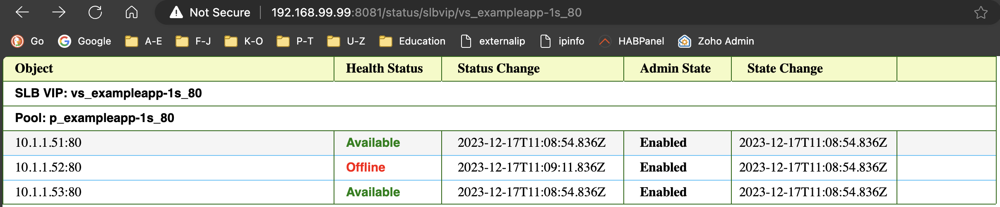

# F5 Poolmember Dashboard API

## Introduction
`F5 Poolmember Dashboard API` application 

## Design

### API Endpoint

The app's frontend exposes an HTTP endpoint for clients to perform `GET` requests with a `GSLB WIP` or `SLB VIP` or a pool name, as a path parameter. The app interacts with a `redis` database which stores pool member related information in two databases:

db0 - Pools with pool members, their states, status and change timestamps
db1 - GSLB WIP to Pool mappings and other metadata
db2 - SLB VIP to Pool mappings and other metadata

The app uses a `WIP` to lookup `db2` or `VIP` to lookup `db3` and get the pool name, and then uses the poolname to lookup `db1` to get pool related paramters.

------

## Examples

### SVG

### JSON

------

